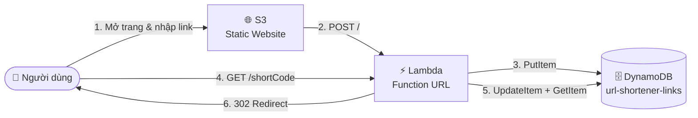

<div align="center">


[)](#)

[](https://aws.amazon.com/)
[](#)
[](https://nodejs.org/)
[](https://www.docker.com/)
[](https://github.com/HuynhTanTon/URLShortener/commits)
[](#)


</div>

---

## 📚 Mục lục

- [Tổng quan](#-tổng-quan)
- [Kiến trúc](#-kiến-trúc)
- [Cấu trúc project](#-cấu-trúc-project)
- [Chạy local bằng Docker](#-chạy-local-bằng-docker)
- [Checklist kiểm thử](#-checklist-kiểm-thử)
- [Deploy lên AWS thật](#-deploy-lên-aws-thật)
- [Nâng cấp: đếm click + cảnh báo lỗi](#-nâng-cấp-đếm-lượt-click--cảnh-báo-lỗi-qua-cloudwatch)
- [Xử lý lỗi thường gặp](#-xử-lý-lỗi-thường-gặp)

---

## 🧭 Tổng quan

Dự án triển khai theo kiến trúc trong `huong-dan-url-shortener-aws.md`: **S3 (frontend) + Lambda Function URL (backend) + DynamoDB** — hoàn toàn serverless, không cần quản lý server.

Để test toàn bộ luồng mà **không cần tài khoản AWS**, repo này giả lập lại đúng 3 thành phần bằng Docker:

| Thành phần AWS thật | Giả lập local bằng Docker | Ghi chú |
|---|---|---|
| 🗄️ DynamoDB | `amazon/dynamodb-local` (image chính thức của AWS) | Chạy `-inMemory`, dữ liệu mất khi restart container |
| ⚡ Lambda Function URL | Node.js HTTP server (`backend/local-server.mjs`) bọc quanh `backend/src/handler.mjs` | **`handler.mjs` là code Lambda thật 100%**, deploy lên AWS không cần sửa gì |
| 🌐 S3 Static Website Hosting | Nginx (`nginx:alpine`) serve thư mục `frontend/` | `index.html` giống hệt file sẽ upload lên S3 |
| 🔍 DynamoDB Console | `dynamodb-admin` (UI web) | Tiện xem item trong bảng khi test |

> [!NOTE]
> `backend/src/handler.mjs` là code Lambda **deploy-được thẳng lên AWS Console, không cần sửa gì**. Mọi hack chỉ dành cho local (SSL, tự tạo bảng...) đều nằm riêng ở `local-server.mjs`, `ensure-table.mjs`, `Dockerfile`.

## 🏗️ Kiến trúc



1. Người dùng mở trang web tĩnh trên **S3**, nhập link dài.
2. Trang gọi `POST /` tới **Lambda Function URL**, Lambda sinh `shortCode` 6 ký tự, lưu vào **DynamoDB**.
3. Khi ai truy cập `shortUrl`, Lambda tra bảng, tăng `clickCount` (atomic), trả về **HTTP 302** redirect tới link gốc.
4. `GET /stats/{shortCode}` cho xem số liệu (link gốc + số lượt click) mà không tăng đếm.

## 📁 Cấu trúc project

```
URLShortener/
├── backend/
│   ├── src/
│   │   ├── handler.mjs         ← Logic Lambda thật (dùng chung local + AWS)
│   │   └── ensure-table.mjs    ← Tự tạo bảng trên DynamoDB Local (chỉ chạy local)
│   ├── local-server.mjs        ← Adapter giả lập Lambda Function URL cho local
│   ├── package.json
│   └── Dockerfile
├── frontend/
│   ├── index.html              ← Giống file sẽ upload lên S3
│   ├── config.js                ← Đang trỏ về http://localhost:3000 (local)
│   └── config.aws.template.js  ← Template để sinh config.js khi deploy AWS thật
├── infra/
│   └── docker/
│       └── docker-compose.yml
└── huong-dan-url-shortener-aws.md   ← Tài liệu hướng dẫn gốc
```

## 🚀 Chạy local bằng Docker

```powershell
cd infra\docker
docker compose up -d --build
```

Sau khi các container chạy (`docker compose ps`), truy cập:

| Dịch vụ | URL |
|---|---|
| 🌐 **Frontend** (trang rút gọn link) | http://localhost:8080 |
| ⚡ **Backend** (giả lập Lambda Function URL) | http://localhost:3000 |
| 🔍 **DynamoDB Admin** (xem bảng `url-shortener-links`) | http://localhost:8001 |
| 🗄️ DynamoDB Local (endpoint SDK) | http://localhost:8000 |

Mở **http://localhost:8080**, nhập 1 link dài, nhấn "Tạo link ngắn" — hệ thống hoạt động đúng như khi chạy trên AWS thật (tạo mã ngắn, lưu DynamoDB, redirect 302).

> [!TIP]
> Luôn test đủ trên Docker local **trước**, chỉ deploy lên AWS thật sau khi mọi thứ đã chạy đúng — đỡ tốn phí và dễ debug hơn nhiều.

<details>
<summary>📋 Xem log / dừng / dọn dẹp</summary>

```powershell
docker compose logs -f backend      # xem log backend
docker compose down                 # dừng & xoá container (dữ liệu DynamoDB in-memory mất luôn)
```

</details>

## ✅ Checklist kiểm thử

<details>
<summary>Xem đầy đủ 8 test case (theo mục 6 tài liệu gốc)</summary>

| STT | Test case | Cách test |
|---|---|---|
| 1 | Tạo link ngắn hợp lệ | Nhập `https://www.google.com` → nhấn "Tạo link ngắn" → trả về `shortUrl` |
| 2 | Redirect đúng | Click vào link ngắn vừa tạo → chuyển hướng đúng tới link gốc |
| 3 | Link không tồn tại | Truy cập `http://localhost:3000/khongtontai` → 404 |
| 4 | Input rỗng | Nhấn "Tạo link ngắn" khi chưa nhập gì → validate ở frontend, không gọi API |
| 5 | Input không phải URL | Nhập `abc123` → backend trả 400 |
| 6 | CORS | Response có header `Access-Control-Allow-Origin: *` |
| 7 | Tạo nhiều link liên tiếp | Mã ngắn không trùng |
| 8 | Dữ liệu trong DynamoDB | Xem qua DynamoDB Admin (http://localhost:8001) |

</details>

## ☁️ Deploy lên AWS thật

Khi đã test ổn trên Docker, deploy lên AWS thật theo đúng mục 3–5 của `huong-dan-url-shortener-aws.md`:

- `backend/src/handler.mjs` chính là code sẽ upload lên Lambda (paste trực tiếp vào `index.mjs` trên Console, không cần `node_modules` vì SDK đã có sẵn trong runtime).
- `frontend/index.html` + `frontend/config.aws.template.js` (copy thành `config.js`, thay `__LAMBDA_URL__` bằng Function URL thật) chính là 2 file upload lên S3.

> [!IMPORTANT]
> Region bắt buộc là **`ap-southeast-1` (Singapore)** cho cả S3, Lambda, DynamoDB — không đổi trừ khi có lý do kỹ thuật rõ ràng và đã xác nhận với người phụ trách.

## 📈 Nâng cấp: đếm lượt click & cảnh báo lỗi qua CloudWatch

### 🖱️ Đếm lượt click (`clickCount`)

Luồng redirect (`GET /{shortCode}`) dùng `UpdateCommand` để tăng `clickCount` **atomic** (an toàn khi nhiều người click cùng lúc), kèm `ConditionExpression: attribute_exists(shortCode)` để vẫn trả 404 đúng khi mã không tồn tại (nếu thiếu điều kiện này, `UpdateItem` sẽ tự tạo item mới thay vì báo lỗi).

Thêm endpoint mới **`GET /stats/{shortCode}`** (không tăng click count, chỉ đọc):

```json
{ "shortCode": "aZ3kT9", "originalUrl": "https://...", "clickCount": 5, "createdAt": "..." }
```

<details>
<summary>🔑 Cần cập nhật IAM policy trên AWS thật</summary>

Thêm quyền `dynamodb:UpdateItem` (mục 3.2 tài liệu gốc hiện chỉ có `PutItem`, `GetItem`):

```json
{
  "Version": "2012-10-17",
  "Statement": [
    {
      "Sid": "AllowDynamoDBAccessToShortenerTable",
      "Effect": "Allow",
      "Action": ["dynamodb:PutItem", "dynamodb:GetItem", "dynamodb:UpdateItem"],
      "Resource": "arn:aws:dynamodb:ap-southeast-1:<ACCOUNT_ID>:table/url-shortener-links"
    }
  ]
}
```

</details>

### 🚨 Cảnh báo lỗi qua CloudWatch

`handler.mjs` luôn `catch` lỗi và trả JSON 500 thay vì throw ra ngoài, nên metric có sẵn `Lambda > Errors` sẽ luôn = 0. Code đã chuẩn hoá log lỗi thành `console.error("[ERROR]", err)` để dùng **CloudWatch Logs Metric Filter** (đọc log, không phụ thuộc Lambda có throw hay không).

Các bước làm trên AWS Console (không có trong code, phải tự làm):

1. **CloudWatch → Log groups → `/aws/lambda/url-shortener-backend` → Metric filters → Create metric filter**
   - Filter pattern: `"[ERROR]"`
   - Đặt tên metric: `URLShortenerErrorCount`
2. **CloudWatch → Alarms → Create alarm** trên metric `URLShortenerErrorCount`
   - Ngưỡng: **≥ 1 lỗi trong 5 phút**
3. Tạo **SNS topic** mới, subscribe email nhận cảnh báo → xác nhận subscription qua email đã nhận được.

## 🛠️ Xử lý lỗi thường gặp

> [!WARNING]
> Nếu máy bạn có phần mềm diệt virus quét SSL (VD: Avast), `npm install` trong container backend có thể báo lỗi `UNABLE_TO_VERIFY_LEAF_SIGNATURE`. `backend/Dockerfile` đã xử lý sẵn bằng `npm config set strict-ssl false` — đây **chỉ là workaround cho môi trường dev local**, không ảnh hưởng gì đến việc deploy lên AWS Lambda thật (Lambda runtime đã có sẵn `@aws-sdk/client-dynamodb` và `@aws-sdk/lib-dynamodb`, không cần `npm install`).

---

<div align="center">


Made with ☕ and 🔗 — chạy thử local trước, deploy AWS sau.

</div>
